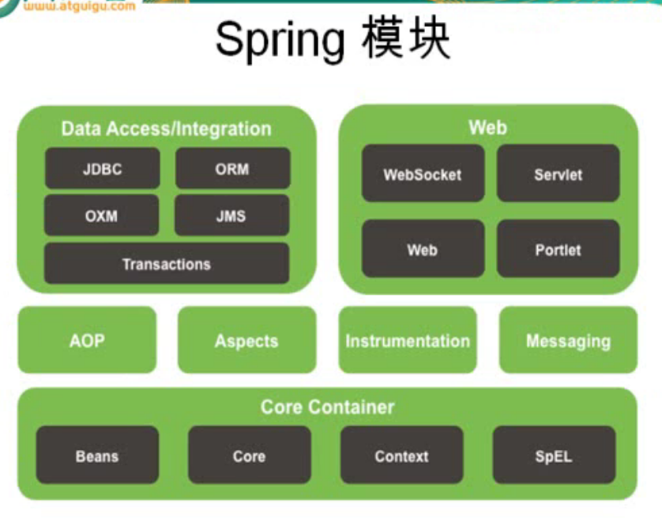
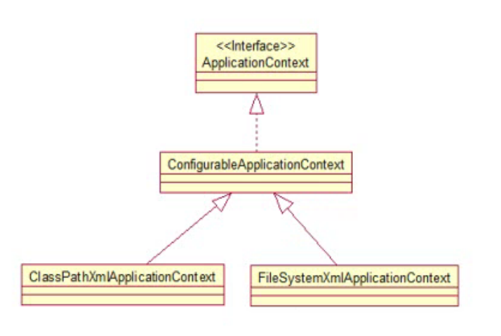

#Spring HelloWorld

> Spring是一个IOC（DI）和AOP容器框架
>
> - 轻量级
>
>   ​Spring是非侵入性的，基于Spring开发的应用中的对象可以不依赖于Spring的API
>
> - 依赖注入（DI---Dependency Injection, 或者叫 IOC--Inversion of Control）
> - 面向切面编程（AOP---Aspect Oriented Programming）
> - 容器
>
>   ​Spring是一个容器，因为它包含并且管理应用对象的生命周期
>
> - 框架
>
>   ​Spring实现了使用简单的组件配置组合成一个复杂的应用。在Spring中可以使用XML和Java注解组合这些对象
>
> - 一站式
>
>   ​在IOC和AOP的基础上，可以整合各种企业应用的开源框架和优秀的第三方类库（实际上Spring自身也提供了展现层的SpringMVC和持久层的Spring JDBC）



一个典型的Spring项目需要创建一个或多个Bean配置文件，这些配置文件用于在Spring IOC容器里配置Bean. Bean的配置文件可以放在classpath下，也可以放在其他目录下。


## Spring中Bean的配置

### IOC & DI 概述

配置Bean

* 配置形式：基于XML文件的方式；基于注解的方式
* Bean的配置方式：通过全类名（反射）、通过工厂方法（静态工厂方法或者实例工厂方法）、通过FactoryBean
* IOC容器BeanFactory & ApplicationContext 概述
* 依赖注入的方式：属性注入；构造器注入
* 注入属性值的细节
* 自动转配
* bean之间的关系：继承；依赖
* bean的作用域：singleton；prototype；WEB环境作用域
* 使用外部属性文件
* SpEL
* IOC容器中Bean的生命周期
* Spring4.x新特性：泛型依赖注入


一、Spring容器

从Spring IOC容器读取Bean配置并创建Bean实例之前，必须对IOC容器进行初始化，只有在容器实例化后，才可以从IOC容器中获取Bean实例并使用。

Spring提供了两种类型的IOC容器的实现：

1. `BeanFactory`（接口）：IOC容器的基本实现
2. `ApplicationContext`（接口）：提供了更多高级的特性，是`BeanFactory`的子接口

其中`BeanFactory`是Spring框架的基础设施，面向Spring本身；`ApplicationContext`面向使用Spring框架的开发者，**几乎所有的应用场合都直接使用`ApplicationContext`而非底层的`BeanFactory`**。无论使用哪一个，配置文件都是相同的。

#### `ApplicationContext`

1. `ApplicationContext`接口有两个主要的实现类
   * `ClassPathXmlApplicationContext`：从类路径下加载配置文件
   * `FileSystemXmlApplicationContext`：从文件系统中加载配置文件
2. `ConfigurableApplicationContext`接口是`ApplicationContext`接口的子接口，它新增了两个主要的方法：`refresh()`和`close()`，让`ApplicationContext`具有启动、刷新和关闭上下文的功能
3. <u>`ApplicationContext`在初始化上下文时就实例化所有**单例**的`Bean`</u>
4. `WebApplicationContext`是专门为WEB而准备的，它允许从相对于WEB应用程序的根目录的路径下加载配置文件来完成初始化工作



#### 依赖注入的方式

1. 属性注入
2. 构造器注入
3. 工厂方法注入（很少使用，不推荐）

##### 属性注入

属性注入是通过`setter`方法注入Bean的属性值或依赖的对象。属性注入使用`<property>`元素，使用`name`属性指定Bean的属性名称，`value`属性或者`<value>`子节点指定属性值。**属性注入是实际应用中最常用的注入方式。**

```xml
<bean id="p2" class="edu.stu.domain.Person">
        <property name="id" value="22"/>
        <property name="name" value="小张"/>
        <property name="gender" value="1"/>
</bean>
```

##### 构造方法注入

通过构造方法注入Bean的属性值或依赖的对象，它保证了Bean实例在实例化后就可以使用。构造器注入在`<constructor-arg>`元素里声明属性。例如，

```java
public class Car {

    private String brand;

    private String tire;

    private Integer price;

    private Integer maxSpeed;

    public Car() {
    }

    public Car(String brand, String tire, Integer price, Integer maxSpeed) {
        this.brand = brand;
        this.tire = tire;
        this.price = price;
        this.maxSpeed = maxSpeed;
    }
}
```

```xml
<!-- 通过构造方法配置bean的属性 -->
<bean id="c1" class="edu.stu.domain.Car">
    <!-- 按照构造器中参数定义的顺序 -->
  	<constructor-arg value="Audi"/>
    <constructor-arg value="ShangHai"/>
    <constructor-arg value="500000"/>
    <constructor-arg value="220"/>
</bean>
```

